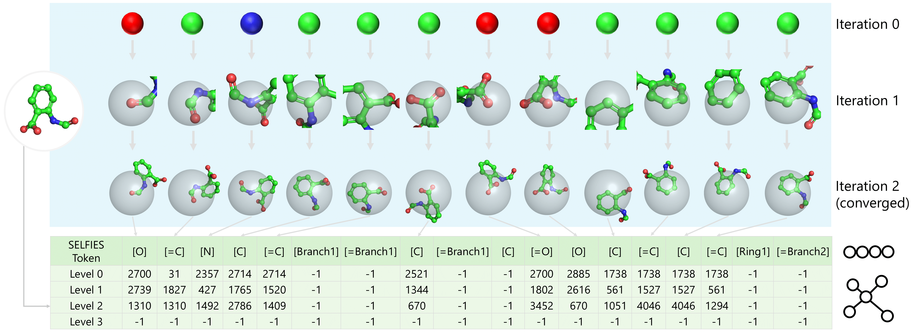
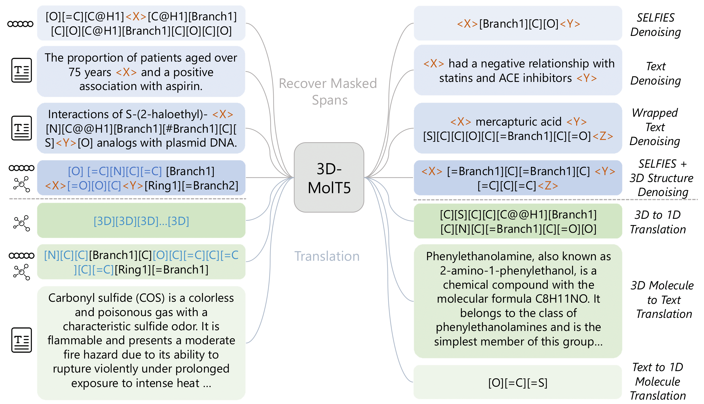

<p align="center">
<h1 align="center">3D-MolT5: Leveraging Discrete Structural Information for Molecule-Text Modeling (ICLR 2025)</h1>

<p align="center">
    <a href="https://openreview.net/forum?id=eGqQyTAbXC"></a>
    <a href="https://github.com/QizhiPei/3D-MolT5/blob/main/LICENSE"></a>
    <a href="https://huggingface.co/collections/QizhiPei/3d-molt5-68b561939178c4b5a349b45f"></a>
</p>





3D-MolT5 is a unified framework designed to enhance language models by integrating molecular sequences, 3D molecular structures, and text sequences. This is accomplished through a key innovation:

* **3D Molecular Tokenization**, which maps fine-grained 3D substructure representations into a specialized 3D token vocabulary based on the Extended 3D Fingerprint (E3FP) algorithm.

* **Unified Architecture**, which seamlessly integrates sequence and structure representations in a tokenized format, enabling 3D-MolT5 to encode molecular sequences, molecular structures, and text sequences within a single framework.

* **Multi-task Pre-training**, which involves joint training with denoising and translation objectives to enhance the model's comprehension and cross-modal alignment within a shared representation space.

3D-MolT5 demonstrates superior performance across various downstream tasks, including molecular property prediction, molecule captioning, and text-based molecule generation, significantly outperforming existing methods. 


## Setup Environment
This is an example for how to set up a working conda environment to run the code.
```shell
git clone https://github.com/QizhiPei/3D-MolT5.git --recursive
cd 3D-MolT5
conda create -n 3dmolt5 python=3.8
# install pytorch that fits your cuda version
pip install torch==2.1.0 --index-url https://download.pytorch.org/whl/cu121
# install other dependencies
pip install -r requirements.txt
```

## Model & Dataset

|3D-MolT5 Model|Dataset|HuggingFace Link 🤗|Finetune Script <br> (`3d_molt5/finetune_scripts`)|Eval Script <br> (`3d_molt5/eval_scripts`)|
|----|----|----|----|----|
|Pre-trained|-|[link](https://huggingface.co/QizhiPei/3d-molt5-base)|
|Fine-tuned on Computed Property Prediction|[link](https://huggingface.co/datasets/QizhiPei/e3fp-pubchemqc-prop)|[Specialist](https://huggingface.co/QizhiPei/3d-molt5-base-pubchemqc-prop) <br> [Generalist](https://huggingface.co/QizhiPei/3d-molt5-base-3d-molm-generalist)|`ft_pqc_prop.sh`|`eval_pqc_prop.sh`|
|Fine-tuned on  Computed Property Prediction (PubChem)|[link](https://huggingface.co/datasets/QizhiPei/e3fp-pubchem-com)|[Specialist](https://huggingface.co/QizhiPei/3d-molt5-base-pubchem-com) <br> [Generalist](https://huggingface.co/QizhiPei/3d-molt5-base-3d-molm-generalist)|`ft_pubchem_com.sh`|`eval_pubchem_com.sh`|
|Fine-tuned on Descriptive Property Prediction (PubChem)|[link](https://huggingface.co/datasets/QizhiPei/e3fp-pubchem-des)|[Specialist](https://huggingface.co/QizhiPei/3d-molt5-base-pubchem-des) <br> [Generalist](https://huggingface.co/QizhiPei/3d-molt5-base-3d-molm-generalist)|`ft_pubchem_des.sh`|`eval_pubchem_des.sh`|
|Fine-tuned on 3D Molecule Captioning (PubChem)|[link](https://huggingface.co/datasets/QizhiPei/e3fp-pubchem-cap)|[Specialist](https://huggingface.co/QizhiPei/3d-molt5-base-pubchem-cap) <br> [Generalist](https://huggingface.co/QizhiPei/3d-molt5-base-3d-molm-generalist)|`ft_pubchem_cap.sh`|`eval_pubchem_cap.sh`|
|Fine-tuned on Computed Property Prediction (QM9)|[link](https://huggingface.co/datasets/QizhiPei/e3fp-mol-instructions-qm9)|[link](https://huggingface.co/QizhiPei/3d-molt5-base-mol-instructions-qm9)|`ft_molinst_qm9.sh`|`eval_molinst_qm9.sh`|
|Fine-tuned on Chemical Reaction-related task (Mol-Instructions), including Reagent Prediction, Forward Reaction Prediction, and Retrosynthesis|[Reagent Prediction](https://huggingface.co/datasets/QizhiPei/e3fp-mol-instructions-reagent-prediction) <br> [Forward Reaction Prediction](https://huggingface.co/datasets/QizhiPei/e3fp-mol-instructions-forward-reaction-prediction) <br> [Retrosynthesis](https://huggingface.co/datasets/QizhiPei/e3fp-mol-instructions-retrosynthesis) <br> [All](https://huggingface.co/datasets/QizhiPei/e3fp-mol-instructions-react-all)|[link](https://huggingface.co/QizhiPei/3d-molt5-base-mol-instructions-react)|`ft_molinst_react.sh`|`eval_molinst_react.sh`|
|Fine-tuned on Text-guided Molecule Generation (ChEBI-20)|[link](https://huggingface.co/datasets/QizhiPei/e3fp-chebi-molgen)|[link](https://huggingface.co/QizhiPei/3d-molt5-base-chebi-molgen)|`ft_chebi_molgen.sh`|`eval_chebi_molgen.sh`|
|Fine-tuned on Retrosynthesis (USPTO-50k)|[link](https://huggingface.co/datasets/QizhiPei/e3fp-uspto-50k)|[link](https://huggingface.co/QizhiPei/3d-molt5-base-uspto-retro)|`ft_uspto.sh`|`eval_uspto.sh`|

## Data Processing
All datasets used in fine-tuning are provided in [HuggingFace](https://huggingface.co/collections/QizhiPei/3d-molt5-68b561939178c4b5a349b45f) as shown in the table above.

We also provide the code for data processing in `3d_tokenization`, which is used to tokenize the 3D molecular structures (`.sdf` file) into a unified format.

```bash
cd 3d_tokenization
python 3d_tokenize.py
```

## Fine-tuning
Please refer to the scripts in `3d_molt5/finetune_scripts` for how to fine-tune the model.
The corresponding script name is shown in the table above.
You can change the `n_gpu` and `CUDA_VISIBLE_DEVICES` as needed.

## Evaluation
Please refer to the scripts in `3d_molt5/eval_scripts` for how to evaluate the model.
The corresponding script name is shown in the table above.
We only test the evaluation code with a single gpu.

## Acknowledgments
We thank the authors of [nanoT5](https://github.com/PiotrNawrot/nanoT5) and [E3FP](https://github.com/keiserlab/e3fp) for their excellent works.

## Citations
```
@inproceedings{pei3d,
  title={3D-MolT5: Leveraging Discrete Structural Information for Molecule-Text Modeling},
  author={Pei, Qizhi and Yan, Rui and Gao, Kaiyuan and Zhu, Jinhua and Wu, Lijun},
  booktitle={The Thirteenth International Conference on Learning Representations}
}
```